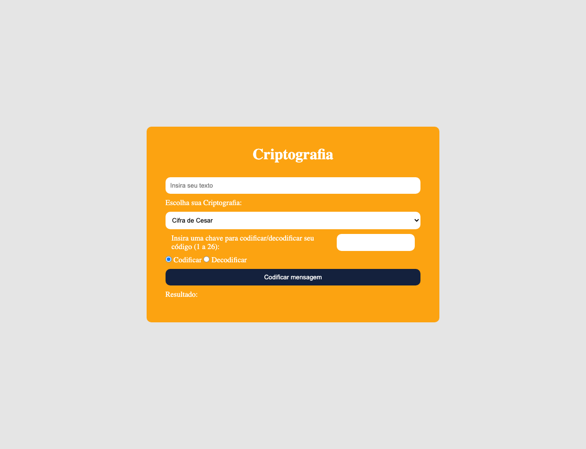

# Crypto

Resilia challenge: Create an application to code and decode a text based on Caesar Cipher or Base64, the user can choose which one is used.

## Screenchot

## Technologies

- HTML
- CSS
- JavaScript

## Author

Ivan Geier
